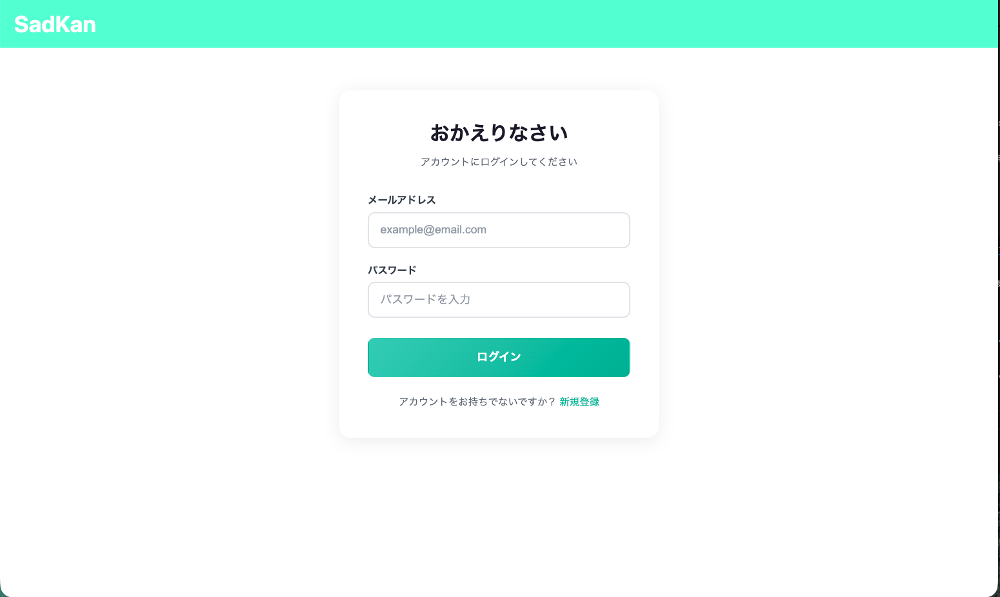
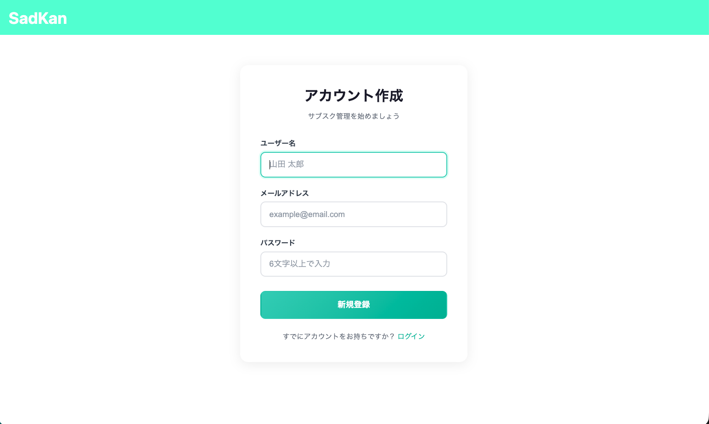
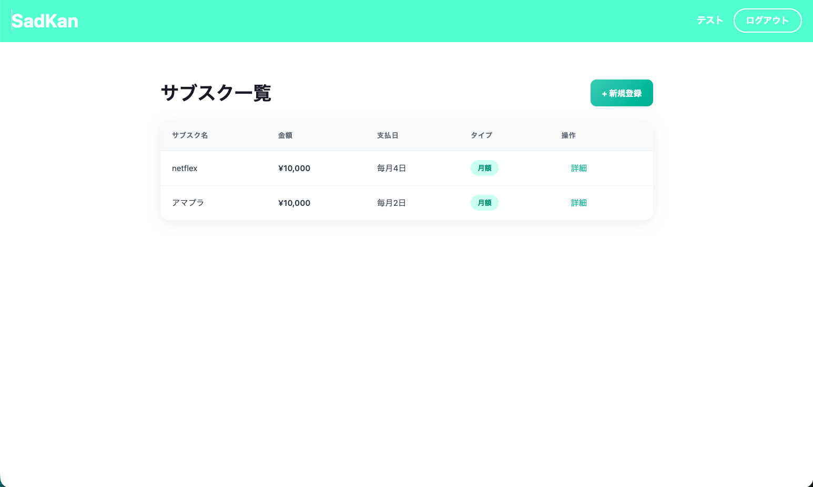
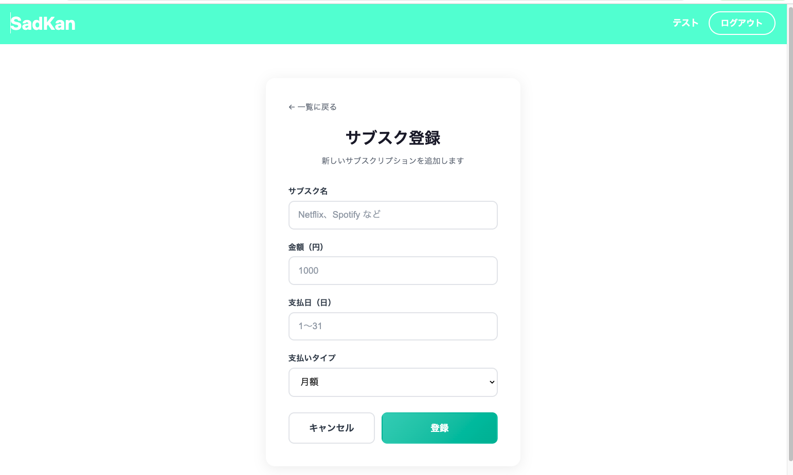
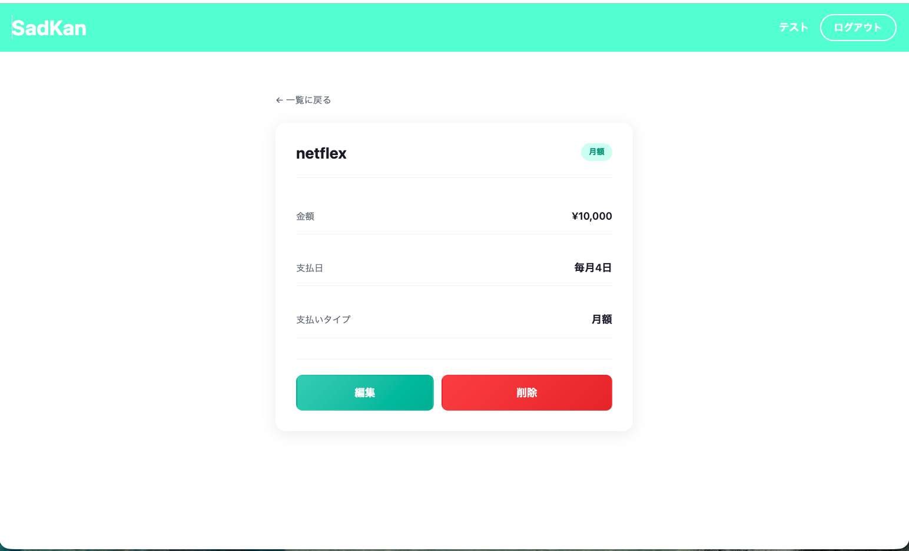
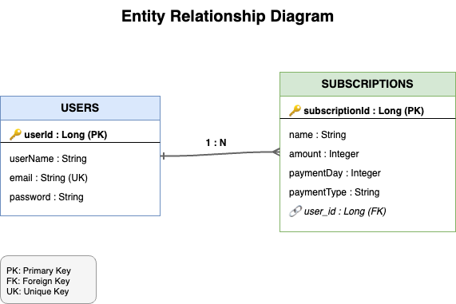

# SadKan - サブスクリプション管理アプリ

**毎月の支出を可視化し、サブスクリプションを賢く管理**

## 概要

SadKanは、契約中のサブスクリプションサービスを一元管理できるWebアプリケーションです。
Netflix、Spotify、Amazon Primeなど、増え続けるサブスクリプションの支払い状況を把握し、無駄な出費を防ぐことができます。

## 画面イメージ

| ログイン | サインアップ |
|:---:|:---:|
|  |  |

| サブスク一覧 | サブスク登録 |
|:---:|:---:|
|  |  |

| サブスク詳細 |
|:---:|
|  |

## 主な機能

| 機能 | 説明 |
|------|------|
| ユーザー認証 | JWT認証によるセキュアなログイン・サインアップ |
| サブスク一覧 | 登録済みサブスクリプションの一覧表示 |
| サブスク登録 | 新規サブスクリプションの追加 |
| サブスク編集 | 登録情報の変更 |
| サブスク削除 | 不要なサブスクリプションの削除 |

## 使用技術

| カテゴリ | 技術スタック |
|----------|--------------|
| フロントエンド | React 18, React Router v7 |
| バックエンド | Java 21, Spring Boot 3.2, Spring Security |
| 認証 | JWT (JSON Web Token) |
| データベース | H2 Database (開発環境) |
| ORM | Spring Data JPA |
| 環境構築 | Docker, Docker Compose |

## ER図



## インフラ構成図

```
┌─────────────────────────────────────────────────────────────┐
│                        Docker                               │
│  ┌─────────────────────┐    ┌─────────────────────────────┐ │
│  │     Frontend        │    │         Backend             │ │
│  │  ┌───────────────┐  │    │  ┌───────────────────────┐  │ │
│  │  │   React 18    │  │    │  │   Spring Boot 3.2     │  │ │
│  │  │   Port: 3000  │──┼────┼─▶│   Port: 8080          │  │ │
│  │  └───────────────┘  │    │  │                       │  │ │
│  │                     │    │  │  ┌─────────────────┐  │  │ │
│  │                     │    │  │  │   H2 Database   │  │  │ │
│  │                     │    │  │  │   (In-Memory)   │  │  │ │
│  │                     │    │  │  └─────────────────┘  │  │ │
│  │                     │    │  └───────────────────────┘  │ │
│  └─────────────────────┘    └─────────────────────────────┘ │
└─────────────────────────────────────────────────────────────┘
```

## ローカル環境での起動方法

### 必要環境

- Docker Desktop
- Git

### インストール手順

```bash
# 1. リポジトリをクローン
git clone https://github.com/your-username/SadKan.git
cd SadKan

# 2. Dockerコンテナをビルド・起動
docker compose build
docker compose up -d
```

### アクセス

- フロントエンド: http://localhost:3000
- バックエンドAPI: http://localhost:8080

## 開発背景

サブスクリプションサービスが増加する現代において、「どのサービスにいくら払っているか分からない」という課題を解決するために開発しました。

月々の支払日や金額を可視化することで、家計の見直しや無駄なサブスクリプションの解約判断に役立てることを目指しています。

## ディレクトリ構成

```
SadKan/
├── frontend/                 # Reactフロントエンド
│   └── src/
│       ├── components/       # 共通コンポーネント
│       ├── pages/            # ページコンポーネント
│       ├── Hooks/            # カスタムフック
│       └── styles/           # スタイル
├── backend/                  # Spring Bootバックエンド
│   └── src/main/java/
│       └── com/example/api/
│           ├── controller/   # APIコントローラー
│           ├── service/      # ビジネスロジック
│           ├── repository/   # データアクセス
│           ├── entity/       # エンティティ
│           ├── dto/          # データ転送オブジェクト
│           └── security/     # 認証・認可
└── docker-compose.yml        # Docker設定
```
